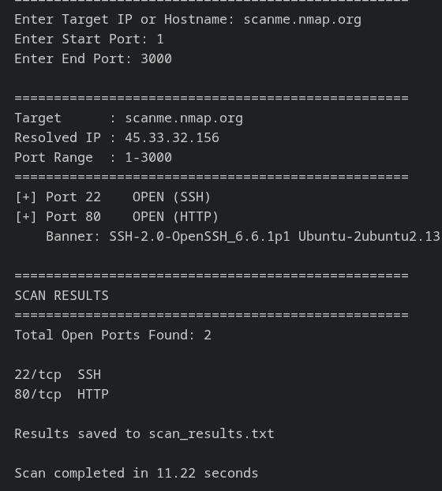

# Python Port Scanner

A multithreaded TCP port scanner built with Python for network enumeration and service discovery.

## Features

* Multithreaded Port Scanning
* Hostname Resolution
* Service Detection
* Banner Grabbing
* Scan Report Export
* Concurrent Scanning using ThreadPoolExecutor

## Technologies Used

* Python
* Socket Programming
* ThreadPoolExecutor
* Networking Fundamentals

## Usage

bash
python Port-scanner.py


Example:

text
Target: scanme.nmap.org
Start Port: 1
End Port: 3000


## Sample Output



## Example Findings

```text
[+] Port 22 OPEN (SSH)
Banner: SSH-2.0-OpenSSH_6.6.1p1 Ubuntu

[+] Port 80 OPEN (HTTP)
```

## Learning Outcomes

* TCP Port Scanning
* Concurrent Programming
* Banner Grabbing
* Network Enumeration
* Report Generation

## Author

Arif Hussain
